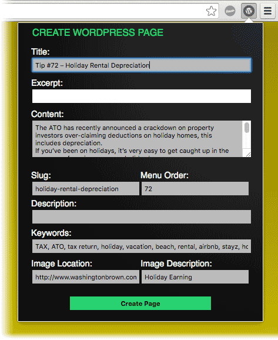

# Web to WordPress

A [Google Chrome](https://www.google.com.au/chrome) extension to grep through the DOM of displayed webpage to collect content for posting to a PHP script which will create a [WordPress](https://wordpress.org/) page. Also finds an image file and uploads it as WordPress media linking it as the thumbnail of the newly created post. Can also collect SEO meta data for use with the [Yoast](https://yoast.com/) plugin.


## Usage

In it's current state the script requires some jQuery dev knowledge and tweaking to your own circumstances and the DOM structure of the page your grepping. The PHP script needs uploading to the same server that WordPress is running on - so this will not work on wordpress.com hosted sites.


## Setup

1. Put PHP script on server. Rename. Change WP location var (see comments in the file)
1. Edit `manifest.js` with the source content's domain name to give permissions for the extension to run
1. Edit `popup.js` with your Wordpress URIs (see comments in the file)
1. Modify `content.js` to get the content from the page you'll run the script on (see comments in the file)
1. In Chrome Extensions Developer mode (chrome://extensions/) _"Load unpacked extension.."_ to `chrome-extension-web2wp`
1. Navigate to the page you want to collect content from and have allowed the plugin to run on
1. Click the 'WP' logo button in your browser tool bar
1. Click *Create page* (if nothing happens, right-click to 'inspect' the source and check errors in the dev console)
1. Check your page content in draft mode in WordPress admin
1. Publish your fetched content in WordPress!

## Potential

* With a very simple change this can create a WordPress blog page
* Split the PHP out and use the extension basics for posting content to different CMSs
* Make the PHP side of it into a WordPress plugin to make it even simpler for non-dev users

## Tested

* Google Chrome 50.0.2661.94
* WordPress 4.5.1 - 4.5.2
* Yoast 2.3.4, 3.2.5

## Tip

If you want to use excerpts on WordPress pages (by default they are only on for "posts"), add the following to the `functions.php` file of your theme:

```
function my_add_excerpts_to_pages() {
     add_post_type_support( 'page', 'excerpt' );
}
add_action( 'init', 'my_add_excerpts_to_pages' );
```

## History

> I needed to move a 70+ static pages into WordPress - I wasn't going to do all that my hand, so I created this script to help me out. The popup allows manual tweaking of content (or to add missing content) before the page is created in WP. While it didn't save me massive amounts of time (as I had to write all this first), it did remove the chance for user-error and boredom. Subsequent uses of this script is where I'll get my time savings - but you can get this now as the hard parts been done for you!


## License

[WTFPL](http://www.wtfpl.net/)


## Credits

For [RMW Web Publishing](http://rwpublishing.net.au)